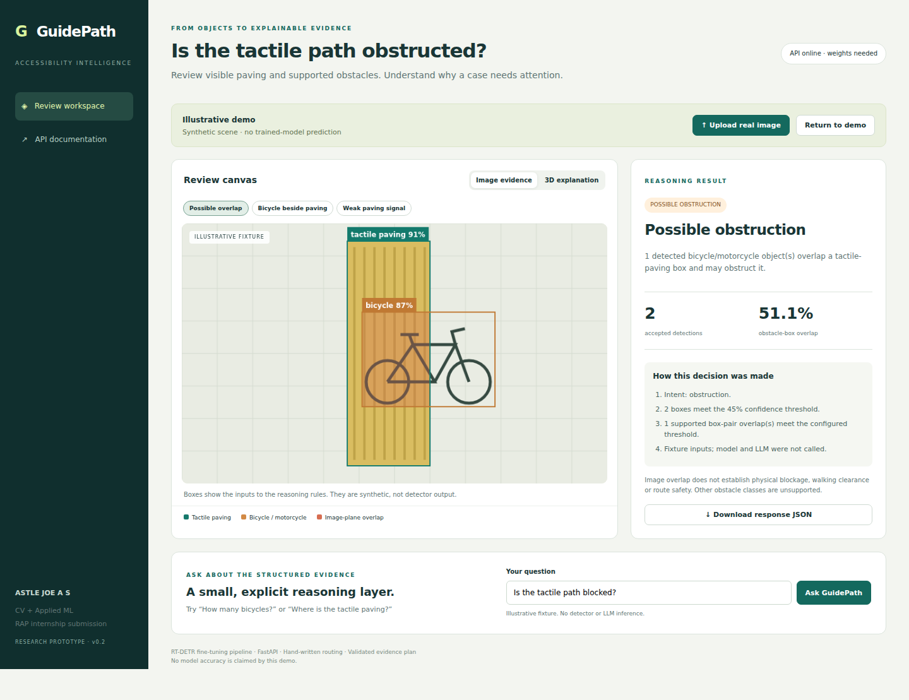

# GuidePath — Obstructed tactile paving
**ASTLE JOE A S · RAP CV + Applied ML screening · Research prototype**

GuidePath turns detections of tactile paving, bicycles and motorcycles into evidence for an accessibility reviewer. A bicycle **beside** paving should not receive the same answer as one whose box **overlaps** it. Missing paving must produce uncertainty.

> **Delivery status:** working software and illustrative demo; final trained weights, measured detection metrics, five observed model failures and live LLM verification are still required. No accuracy or societal impact improvement is claimed. See [evidence status](docs/EVIDENCE_STATUS.md).



## Run the interface first
Python 3.11 or 3.12 recommended. From this folder:

```bash
python -m venv .venv
# macOS / Linux
source .venv/bin/activate
# Windows PowerShell alternative: .venv\Scripts\Activate.ps1
python -m pip install -r requirements-ui.txt
python -m uvicorn guidepath.api:app --host 127.0.0.1 --port 8000
```

Open **http://127.0.0.1:8000**. API docs: **http://127.0.0.1:8000/docs**.
If Windows activation is restricted, replace `python` with `.venv\Scripts\python.exe` in the install/run commands.

The three labelled scenarios run without a GPU, trained weights or paid API. Click **3D explanation** and move both sliders. This is conceptual geometry, not depth recovered from a photograph. Uploading a real image calls the actual detector; missing weights return HTTP 503, with no fixture substitution.

## Enable real detection and LLM reasoning

```bash
python -m pip install -r requirements.txt
python -m scripts.install_weights --source /absolute/path/to/YOUR_FINETUNED/best.pt
```

The checkpoint must be your fine-tuned RT-DETR model with class order `tactile_paving, bicycle, motorcycle`. Stock COCO weights do not satisfy the task. Copy `.env.example` to `.env`; set `GUIDEPATH_DEVICE=cpu` locally or `0` for a CUDA GPU. Set `LLM_API_URL` to your HTTPS chat-completions endpoint, `LLM_API_KEY` and `LLM_MODEL`. Restart the server after changing configuration.

`POST /reason` uses one handwritten router and direct HTTP to the LLM. Code computes counts and overlap facts, the LLM selects a typed evidence plan, and code validates its conclusion and fact IDs before rendering. Missing credentials or invalid provider output produce an explicit deterministic fallback. To demonstrate the assignment's LLM step, save a **real** response with `llm_used: true`; mocked tests do not establish this.

## Train, evaluate, submit

Use [GuidePath_Colab.ipynb](GuidePath_Colab.ipynb). Full commands and recovery: [TRAINING.md](docs/TRAINING.md). The notebook preserves checkpoint outputs on mounted Drive. One epoch is only a smoke experiment; no completion time is promised.

```bash
python -m pip install -r requirements-dev.txt
python -m pytest -q
python -m scripts.verify_submission
```

The readiness script reports missing evidence rather than assigning a score. Its file checks do not prove correctness. Test evidence is in [outputs/verification](outputs/verification).

| Requirement | Implementation | Evidence still needed |
|---|---|---|
| Custom object class + own dataset preparation | `blind_road` → `tactile_paving`, WOTR VOC conversion, audit and explicit cleanup | Final cleaned manifest and reviewed location groups |
| Fine-tune RT-DETR | `scripts/train.py`, durable run metadata and resume | Actual completed run and deliverable `best.pt` |
| mAP, precision/recall, confusion | `scripts/evaluate.py`, plots, per-class summary, checkpoint hash | Measured outputs |
| Image detection endpoint | `POST /detect` | Real checkpoint end-to-end response |
| Natural-language reasoning, no frameworks | `POST /reason`, router → detector → evidence ledger → LLM plan → validator | Live LLM receipt |
| Guardrail | Three obstruction states, unsupported-question routing, evidence validation | Held-out reasoning assessment |
| Failure analysis | `scripts/collect_cases.py`, review template | Five actual model failures |
| Reproducibility + delivery | Tests, notebook, Dockerfile, API examples | Public repository and weights release URL |

## Explore the project

- [Architecture and decision flow](docs/ARCHITECTURE.md)
- [Before / after, novelty and social value](docs/PROJECT_EXPLAINED.md)
- [API examples](docs/API_EXAMPLES.md)
- [Data card](docs/DATA_CARD.md) and [model card](docs/MODEL_CARD.md)
- [GitHub publishing steps](docs/GITHUB_UPLOAD.md)
- [Two-page technical memo](docs/reports/ASTLE_JOE_AS_GuidePath_Technical_Memo.pdf)
- [Illustrated project report](docs/reports/GuidePath_Illustrated_Project_Report.pdf)

## Docker

```bash
docker build -t guidepath .
docker run --rm -p 8000:8000 --env-file .env -v "$PWD/weights:/app/weights:ro" guidepath
```

Use an absolute host weights path on Windows. The image starts the UI/API; real inference still needs the mounted checkpoint. This Dockerfile has not been built in the supplied development environment.

## Scope and attribution

GuidePath supports review of visible image-plane evidence, not pedestrian navigation or safety certification. Other obstacles, depth, physical clearance and unseen areas are outside scope. Detection confidence is not a probability of real obstruction. WOTR images are not bundled. Source/terms: [THIRD_PARTY.md](THIRD_PARTY.md). AI assisted the implementation and documentation; the candidate should be able to explain and defend the decisions.
