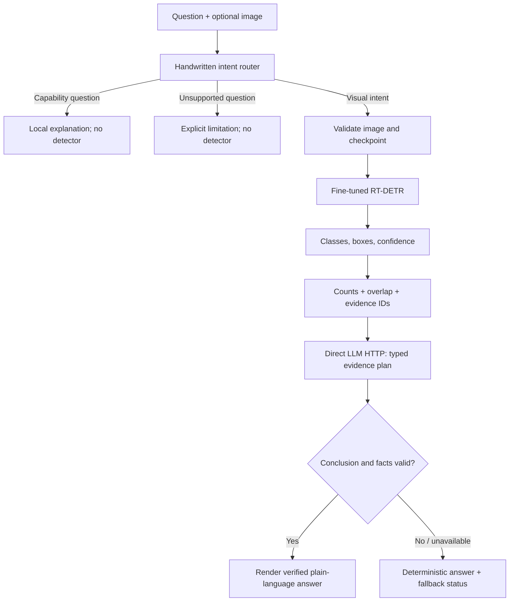
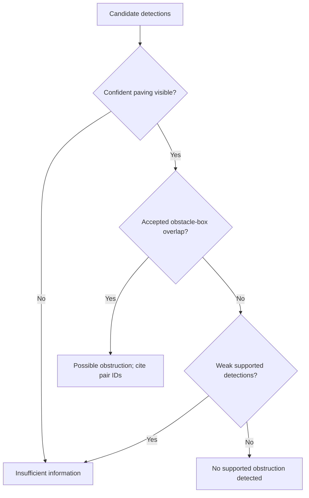
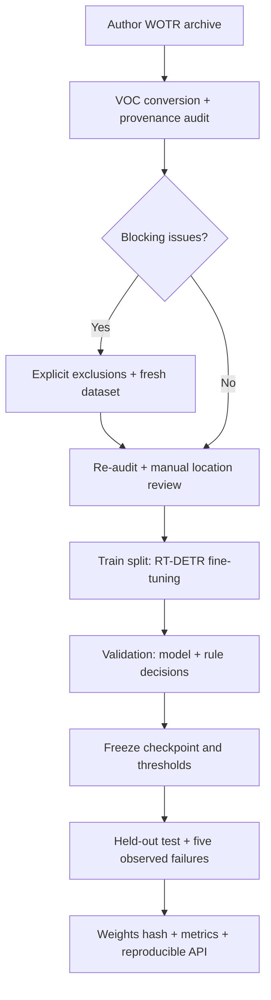

# Architecture

## Runtime: one handwritten decision layer

`/detect` ends after structured detection output. `/reason` uses the full branch. No LangChain, LangGraph, CrewAI or agent orchestration is used. The LLM can select/order verified facts and caveats; it cannot introduce visual facts or overrule the deterministic guardrail. This constrained plan trades linguistic flexibility for traceability. Live provider behavior still needs verification.

## Obstruction flow

For obstacle box O and paving box P, the score is **area(O ∩ P) / area(O)**, not IoU and not physical blocked-path percentage. Provisional thresholds are 0.45 accepted confidence, 0.15 candidate floor and 0.10 overlap. Tune on validation evidence only, record the selected configuration, then freeze it before test evaluation.

## Training and evidence

The 3D canvas is a separate teaching aid. It neither feeds nor consumes detector geometry; moving it changes only its conceptual scene.
